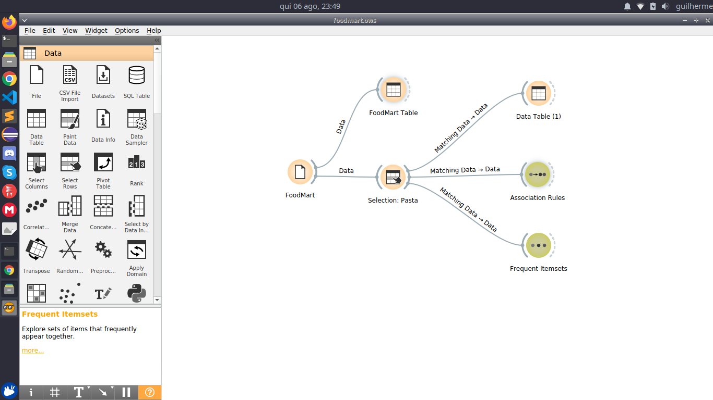
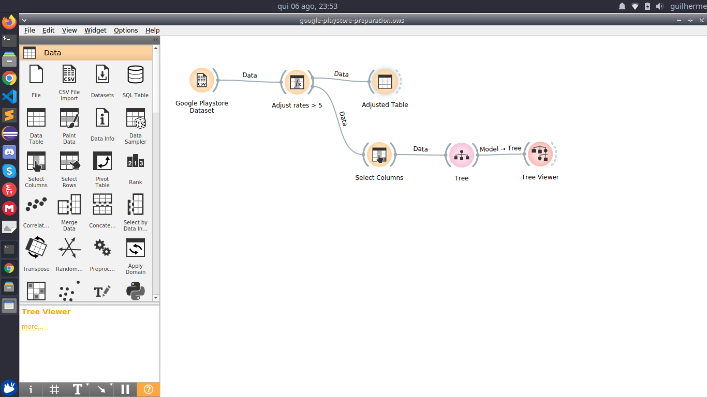
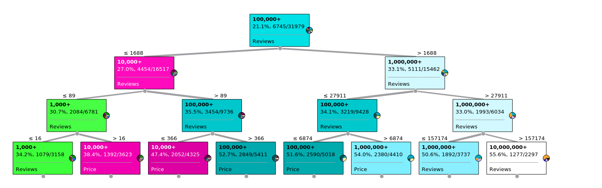
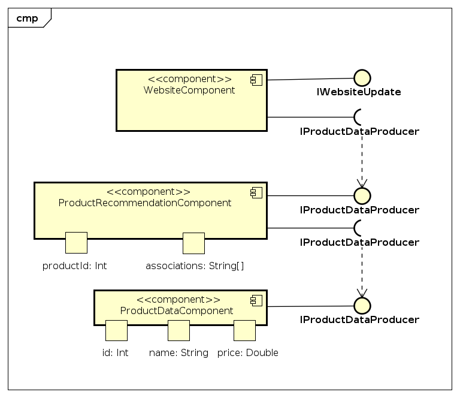
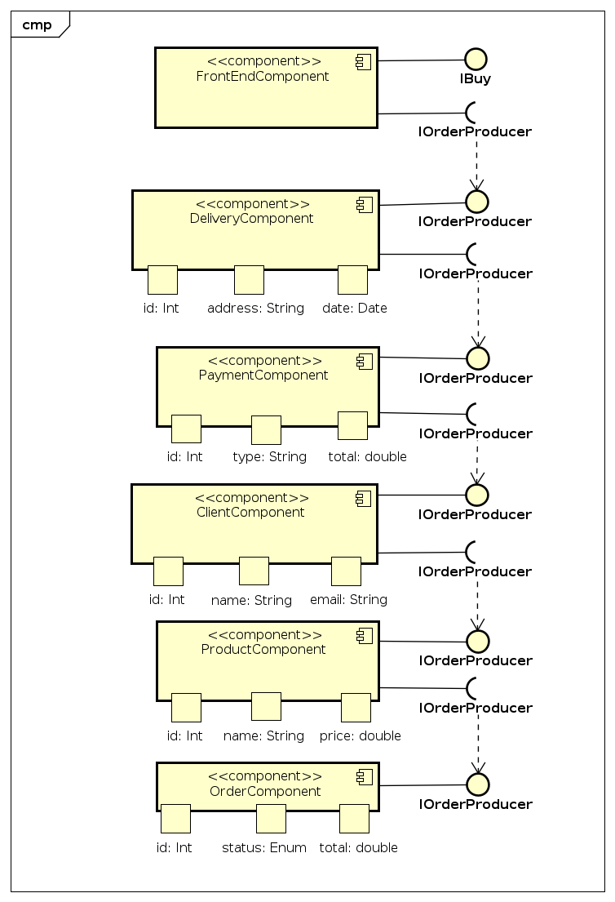
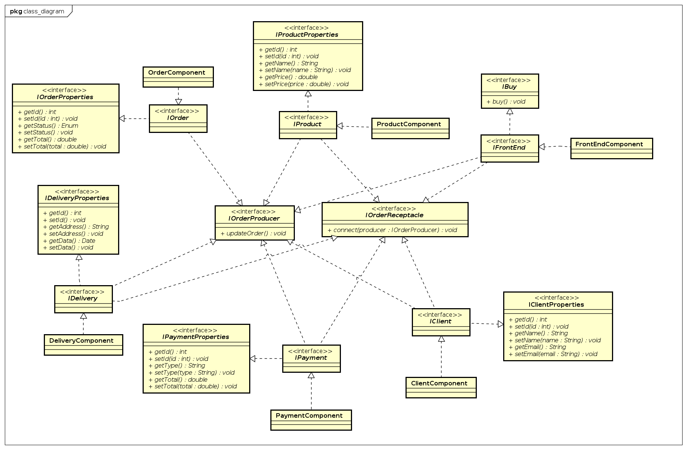

# Lab01 - Data Flow <!-- omit in toc -->

- [Projeto Orange / Regras de Associação para Foodmart](#projeto-orange--regras-de-associação-para-foodmart)
  - [Imagem do Projeto](#imagem-do-projeto)
  - [Arquivo do Projeto](#arquivo-do-projeto)
- [Projeto Orange / Análise de Dados do Google PlayStore](#projeto-orange--análise-de-dados-do-google-playstore)
  - [Imagem do Projeto](#imagem-do-projeto-1)
  - [Arquivo do Projeto](#arquivo-do-projeto-1)
  - [Gráfico(s) de Análise](#gráficos-de-análise)
- [Projeto de Composição de Componentes para Recomendação](#projeto-de-composição-de-componentes-para-recomendação)
- [Projeto de Composição de Componentes para Pedido](#projeto-de-composição-de-componentes-para-pedido)
  - [Diagrama de Componentes](#diagrama-de-componentes)
  - [Diagrama de Interfaces](#diagrama-de-interfaces)

## Projeto Orange / Regras de Associação para Foodmart

### Imagem do Projeto

### Arquivo do Projeto
[Arquivo orange](orange/foodmart.ows)

## Projeto Orange / Análise de Dados do Google PlayStore

### Imagem do Projeto

### Arquivo do Projeto
[Arquivo orange](orange/google_play.ows)

### Gráfico(s) de Análise

## Projeto de Composição de Componentes para Recomendação

## Projeto de Composição de Componentes para Pedido

### Diagrama de Componentes

### Diagrama de Interfaces

