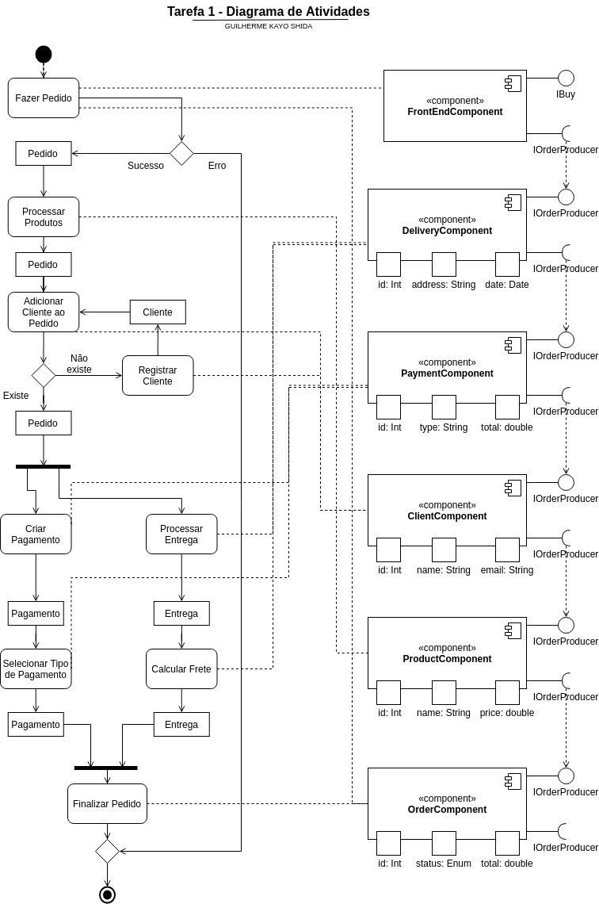
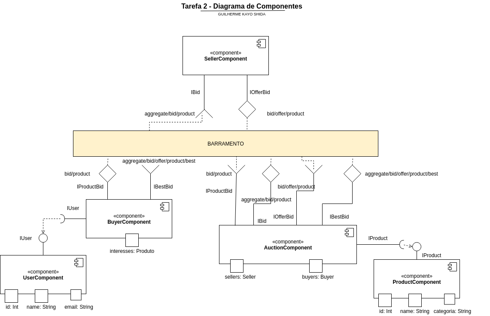
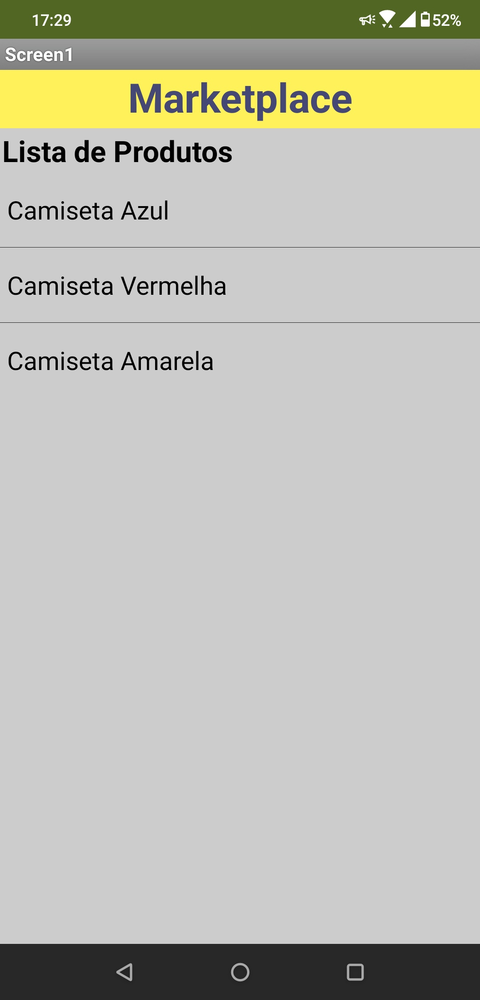
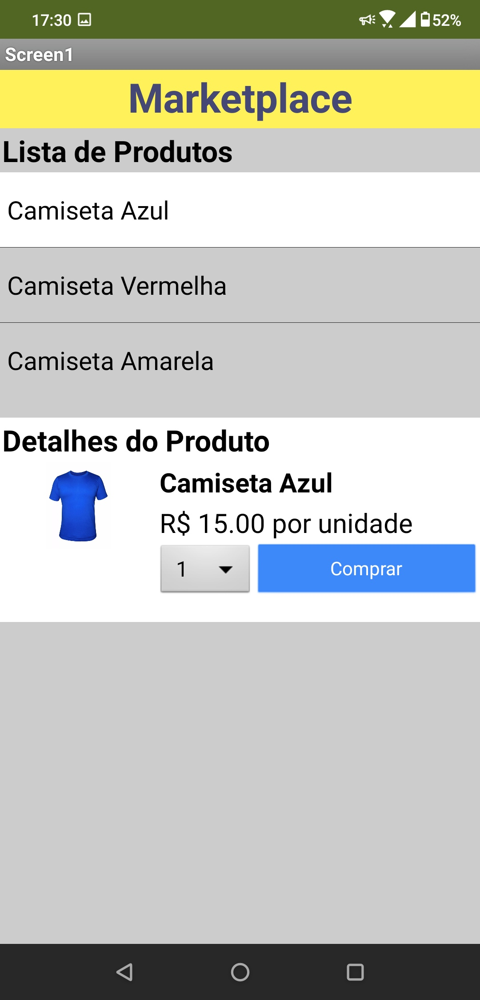
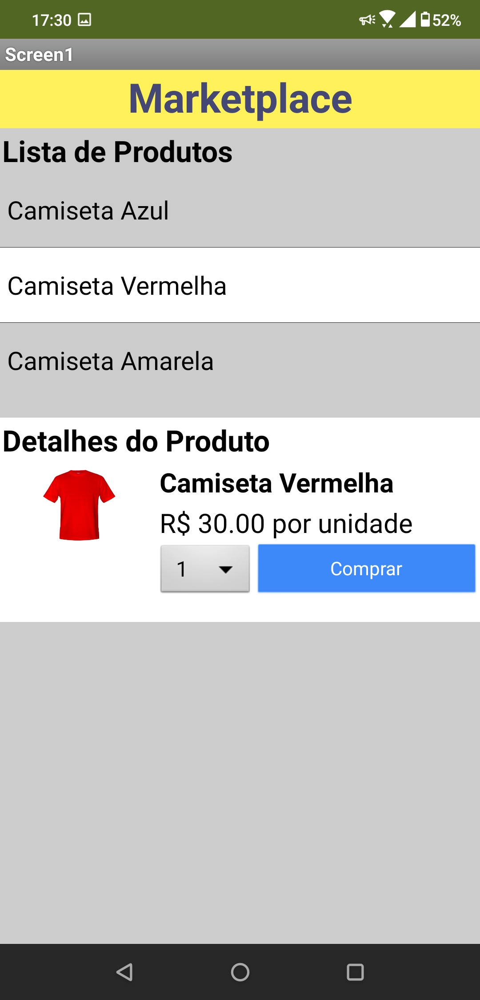
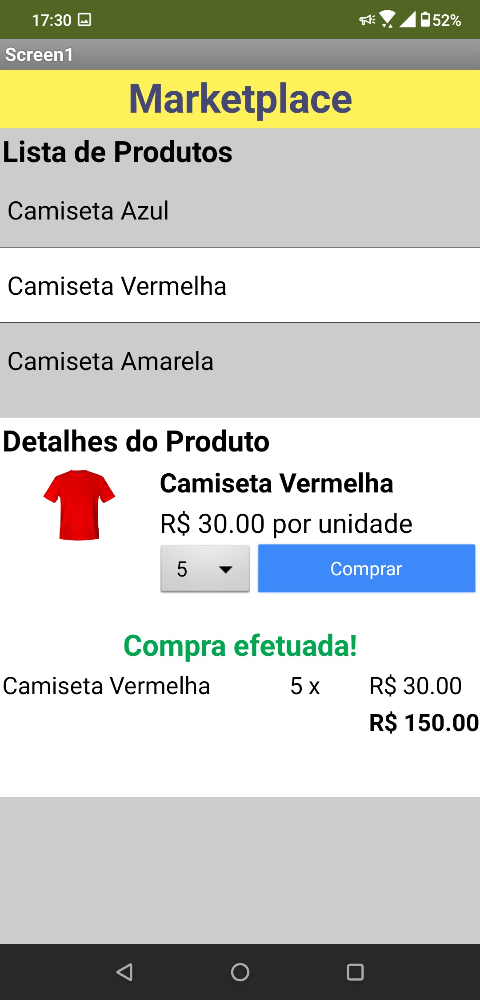
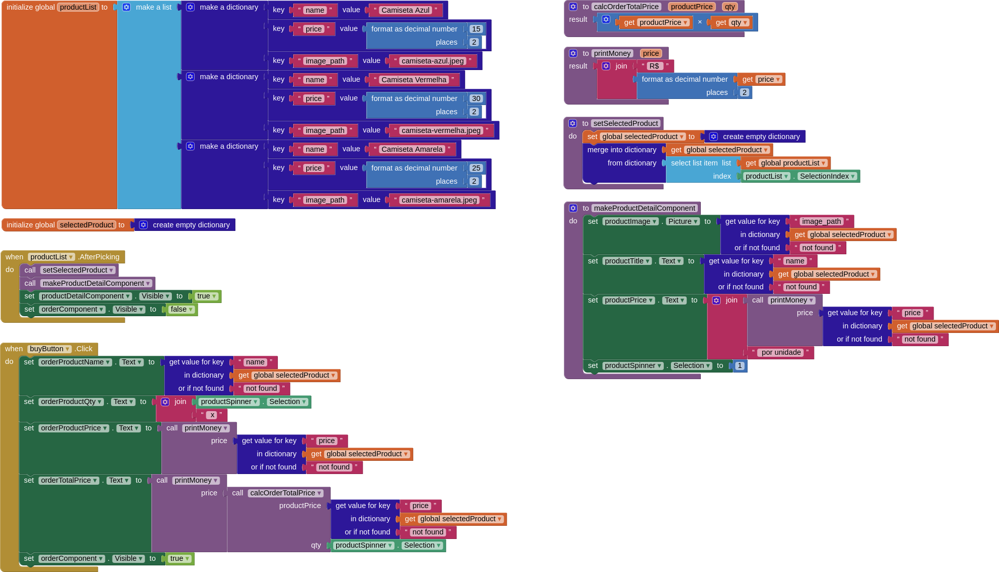

# Lab03 - MVC <!-- omit in toc -->

- [Tarefa 1](#tarefa-1)
- [Tarefa 2](#tarefa-2)
- [Tarefa 3](#tarefa-3)
  - [Diagrama de Blocos do Aplicativo](#diagrama-de-blocos-do-aplicativo)
- [Tarefa 4](#tarefa-4)

## Tarefa 1

## Tarefa 2

## Tarefa 3

Nenhum Produto             |  Primeiro Produto Selecionado
:-------------------------:|:-------------------------:
  |  

Segundo Produto Selecionado             |  Compra Efetuada
:-------------------------:|:-------------------------:
  |  

### Diagrama de Blocos do Aplicativo

## Tarefa 4

[Link para o repositório da equipe 7](https://github.com/inf331-equipe7/tarefas)