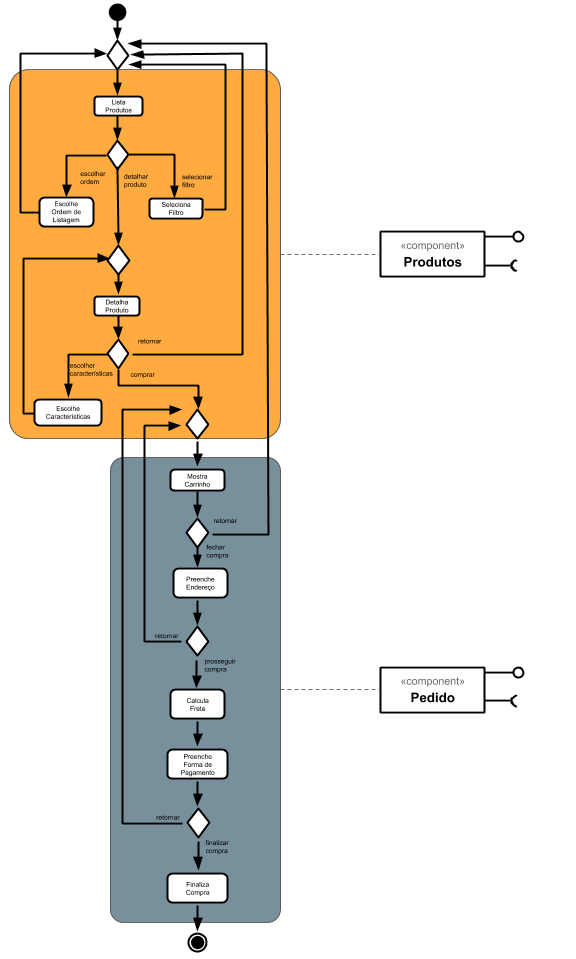
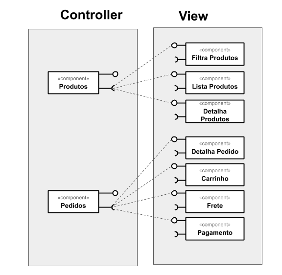
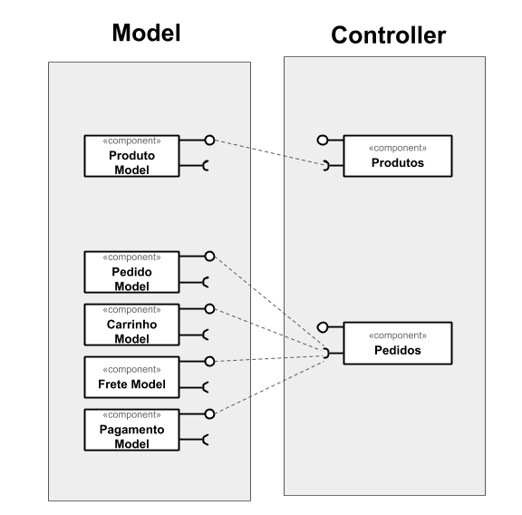

# Lab04 - Serviços <!-- omit in toc -->

- [Tarefa 1](#tarefa-1)
- [Tarefa 2](#tarefa-2)
- [Tarefa 3](#tarefa-3)
- [Tarefa 4](#tarefa-4)
  - [Serviço 1](#serviço-1)
  - [Serviço 2](#serviço-2)

## Tarefa 1

## Tarefa 2

## Tarefa 3

## Tarefa 4

### Serviço 1

- **Título do serviço**: `OMDb API`
- **Breve descrição**:
  Serviço que retorna as informações de um filme.
  Existem vários parâmetros que podem ser usados ([lista](http://www.omdbapi.com/#parameters)), para esta tarefa utilizei somente os parâmetros _title_ (`t`) e _plot_ (`plot`). O parâmetro `apikey` pode ser gerado no [link](http://www.omdbapi.com/apikey.aspx).
- **URL completa da requisição**: `http://www.omdbapi.com/?apikey=175f703a&t=Kill+Bill&plot=full`
- **Cabeçalho HTTP da chamada**:
~~~http
GET /?apikey=175f703a&t=Kill+Bill&plot=full HTTP/1.1
User-Agent: PostmanRuntime/7.26.3
Accept: */*
Postman-Token: 6fe74918-3f3a-4a64-b724-69d8c3af1f98
Host: www.omdbapi.com
Accept-Encoding: gzip, deflate, br
Connection: keep-alive
Cookie: __cfduid=d57dd0fd94390ca72437b7f74de19a9b21598559063
~~~
- **Cabeçalho HTTP da resposta**:
~~~http
HTTP/1.1 200 OK
Date: Thu, 27 Aug 2020 20:18:31 GMT
Content-Type: application/json; charset=utf-8
Transfer-Encoding: chunked
Connection: keep-alive
Cache-Control: public, max-age=86400
Expires: Thu, 27 Aug 2020 21:11:31 GMT
Last-Modified: Thu, 27 Aug 2020 20:11:31 GMT
Vary: *, Accept-Encoding
X-AspNet-Version: 4.0.30319
X-Powered-By: ASP.NET
Access-Control-Allow-Origin: *
CF-Cache-Status: HIT
Age: 420
cf-request-id: 04d32b7aee0000f83fc93d7200000001
Server: cloudflare
CF-RAY: 5c987b717c83f83f-GIG
Content-Encoding: gzip
~~~
- **Conteúdo da resposta**:
~~~json
{
    "Title": "Kill Bill: Vol. 1",
    "Year": "2003",
    "Rated": "R",
    "Released": "10 Oct 2003",
    "Runtime": "111 min",
    "Genre": "Action, Crime, Thriller",
    "Director": "Quentin Tarantino",
    "Writer": "Quentin Tarantino, Quentin Tarantino (character The Bride), Uma Thurman (character The Bride)",
    "Actors": "Uma Thurman, Lucy Liu, Vivica A. Fox, Daryl Hannah",
    "Plot": "The lead character, called 'The Bride,' was a member of the Deadly Viper Assassination Squad, led by her lover 'Bill.' Upon realizing she was pregnant with Bill's child, 'The Bride' decided to escape her life as a killer. She fled to Texas, met a young man, who, on the day of their wedding rehearsal was gunned down by an angry and jealous Bill (with the assistance of the Deadly Viper Assassination Squad). Four years later, 'The Bride' wakes from a coma, and discovers her baby is gone. She, then, decides to seek revenge upon the five people who destroyed her life and killed her baby. The saga of Kill Bill Volume I begins.",
    "Language": "English, Japanese, French",
    "Country": "USA, Japan",
    "Awards": "Nominated for 1 Golden Globe. Another 28 wins & 102 nominations.",
    "Poster": "https://m.media-amazon.com/images/M/MV5BNzM3NDFhYTAtYmU5Mi00NGRmLTljYjgtMDkyODQ4MjNkMGY2XkEyXkFqcGdeQXVyNzkwMjQ5NzM@._V1_SX300.jpg",
    "Ratings": [
        {
            "Source": "Internet Movie Database",
            "Value": "8.1/10"
        },
        {
            "Source": "Rotten Tomatoes",
            "Value": "85%"
        },
        {
            "Source": "Metacritic",
            "Value": "69/100"
        }
    ],
    "Metascore": "69",
    "imdbRating": "8.1",
    "imdbVotes": "975,150",
    "imdbID": "tt0266697",
    "Type": "movie",
    "DVD": "13 Apr 2004",
    "BoxOffice": "N/A",
    "Production": "Miramax Films",
    "Website": "N/A",
    "Response": "True"
}
~~~

### Serviço 2

- **Título do serviço**: `Giphy`
- **Breve descrição**:
  Serviço que busca por um GIF.
  Existem vários parâmetros que podem ser usados ([lista](https://developers.giphy.com/docs/api/endpoint#search)), para esta tarefa utilizei somente os parâmetros _query_ (`q`), _limit_ (`limit`) e _rating_ (`rating`). O parâmetro `api_key` pode ser gerado registrando-se no serviço.
- **URL completa da requisição**: `https://api.giphy.com/v1/gifs/search?api_key=Fq8T1xrw2D8ROjMonzOpEtiiZmGJGzwV&q=funny&limit=1&rating=g`
- **Cabeçalho HTTP da chamada**:
~~~http
GET /v1/gifs/search?api_key=Fq8T1xrw2D8ROjMonzOpEtiiZmGJGzwV&q=funny&limit=1&rating=g HTTP/1.1
User-Agent: PostmanRuntime/7.26.3
Accept: */*
Postman-Token: f67878a6-82c6-4f8e-b946-1c2a1b2589e9
Host: api.giphy.com
Accept-Encoding: gzip, deflate, br
Connection: keep-alive
~~~
- **Cabeçalho HTTP da resposta**:
~~~http
HTTP/1.1 200 OK
Connection: keep-alive
Content-Length: 1307
Content-Type: application/json
x-response-time: 63ms
Content-Encoding: br
Access-Control-Allow-Credentials: true
Access-Control-Allow-Headers: Content-Type, Accept to Content-Type, Accept, x-requested-with, cache-control, X-GIPHY-SDK-NAME, X-GIPHY-SDK-VERSION, X-GIPHY-SDK-PLATFORM
Access-Control-Allow-Methods: GET, POST, PUT, DELETE, OPTIONS
Access-Control-Allow-Origin: *
X-Cachiness-Shield-Rule: giphy_api_search_long_ttl
X-Cachiness-Shield-Desired-TTL: 21600s
X-Cachiness-Shield-Actual-TTL: 21600.000
X-Rule-Debug: 1
X-Cachiness-Edge-Rule: giphy_api_search_long_ttl
X-Cachiness-Edge-Desired-TTL: 21600s
X-Cachiness-Edge-Actual-TTL: 21600.000
X-Cachiness-Edge-Age: 0
Accept-Ranges: bytes
Date: Thu, 27 Aug 2020 21:06:23 GMT
Age: 10
cache-control: max-age=30
Strict-Transport-Security: max-age=86400
X-Served-By: cache-bwi5125-BWI, cache-pdk17853-PDK
X-Cache-Hits: 0, 1
X-Timer: S1598562383.335024,VS0,VE0
Vary: Accept-Encoding
~~~
- **Conteúdo da resposta**:
~~~json
{
    "data": [
        {
            "type": "gif",
            "id": "SggILpMXO7Xt6",
            "url": "https://giphy.com/gifs/sblobbery-clbarrr-idzz-SggILpMXO7Xt6",
            "slug": "sblobbery-clbarrr-idzz-SggILpMXO7Xt6",
            "bitly_gif_url": "http://gph.is/2n1VsfF",
            "bitly_url": "http://gph.is/2n1VsfF",
            "embed_url": "https://giphy.com/embed/SggILpMXO7Xt6",
            "username": "",
            "source": "https://www.youtube.com/watch?v=eVw6i4l6xTg",
            "title": "funny dog GIF",
            "rating": "g",
            "content_url": "",
            "tags": [],
            "featured_tags": [],
            "user_tags": [],
            "source_tld": "www.youtube.com",
            "source_post_url": "https://www.youtube.com/watch?v=eVw6i4l6xTg",
            "is_sticker": 0,
            "import_datetime": "2017-03-16 06:12:42",
            "trending_datetime": "2020-02-18 21:30:01",
            "images": {
                "original": {
                    "height": "262",
                    "width": "480",
                    "size": "1417303",
                    "url": "https://media4.giphy.com/media/SggILpMXO7Xt6/giphy.gif?cid=1ffe016fv0ncafrshj0fwjnwpy06hj0mydtzdtgot5l2t093&rid=giphy.gif",
                    "mp4_size": "45652",
                    "mp4": "https://media4.giphy.com/media/SggILpMXO7Xt6/giphy.mp4?cid=1ffe016fv0ncafrshj0fwjnwpy06hj0mydtzdtgot5l2t093&rid=giphy.mp4",
                    "webp_size": "258172",
                    "webp": "https://media4.giphy.com/media/SggILpMXO7Xt6/giphy.webp?cid=1ffe016fv0ncafrshj0fwjnwpy06hj0mydtzdtgot5l2t093&rid=giphy.webp",
                    "frames": "18",
                    "hash": "59ce667c5cb01232122c426168265bf2"
                },
                "downsized": {
                    "height": "262",
                    "width": "480",
                    "size": "1417303",
                    "url": "https://media4.giphy.com/media/SggILpMXO7Xt6/giphy.gif?cid=1ffe016fv0ncafrshj0fwjnwpy06hj0mydtzdtgot5l2t093&rid=giphy.gif"
                },
                "downsized_large": {
                    "height": "262",
                    "width": "480",
                    "size": "1417303",
                    "url": "https://media4.giphy.com/media/SggILpMXO7Xt6/giphy.gif?cid=1ffe016fv0ncafrshj0fwjnwpy06hj0mydtzdtgot5l2t093&rid=giphy.gif"
                },
                "downsized_medium": {
                    "height": "262",
                    "width": "480",
                    "size": "1417303",
                    "url": "https://media4.giphy.com/media/SggILpMXO7Xt6/giphy.gif?cid=1ffe016fv0ncafrshj0fwjnwpy06hj0mydtzdtgot5l2t093&rid=giphy.gif"
                },
                "downsized_small": {
                    "height": "262",
                    "width": "480",
                    "mp4_size": "45006",
                    "mp4": "https://media4.giphy.com/media/SggILpMXO7Xt6/giphy-downsized-small.mp4?cid=1ffe016fv0ncafrshj0fwjnwpy06hj0mydtzdtgot5l2t093&rid=giphy-downsized-small.mp4"
                },
                "downsized_still": {
                    "height": "262",
                    "width": "480",
                    "size": "1417303",
                    "url": "https://media4.giphy.com/media/SggILpMXO7Xt6/giphy_s.gif?cid=1ffe016fv0ncafrshj0fwjnwpy06hj0mydtzdtgot5l2t093&rid=giphy_s.gif"
                },
                "fixed_height": {
                    "height": "200",
                    "width": "366",
                    "size": "862411",
                    "url": "https://media4.giphy.com/media/SggILpMXO7Xt6/200.gif?cid=1ffe016fv0ncafrshj0fwjnwpy06hj0mydtzdtgot5l2t093&rid=200.gif",
                    "mp4_size": "29467",
                    "mp4": "https://media4.giphy.com/media/SggILpMXO7Xt6/200.mp4?cid=1ffe016fv0ncafrshj0fwjnwpy06hj0mydtzdtgot5l2t093&rid=200.mp4",
                    "webp_size": "138484",
                    "webp": "https://media4.giphy.com/media/SggILpMXO7Xt6/200.webp?cid=1ffe016fv0ncafrshj0fwjnwpy06hj0mydtzdtgot5l2t093&rid=200.webp"
                },
                "fixed_height_downsampled": {
                    "height": "200",
                    "width": "366",
                    "size": "275573",
                    "url": "https://media4.giphy.com/media/SggILpMXO7Xt6/200_d.gif?cid=1ffe016fv0ncafrshj0fwjnwpy06hj0mydtzdtgot5l2t093&rid=200_d.gif",
                    "webp_size": "66682",
                    "webp": "https://media4.giphy.com/media/SggILpMXO7Xt6/200_d.webp?cid=1ffe016fv0ncafrshj0fwjnwpy06hj0mydtzdtgot5l2t093&rid=200_d.webp"
                },
                "fixed_height_small": {
                    "height": "100",
                    "width": "183",
                    "size": "255397",
                    "url": "https://media4.giphy.com/media/SggILpMXO7Xt6/100.gif?cid=1ffe016fv0ncafrshj0fwjnwpy06hj0mydtzdtgot5l2t093&rid=100.gif",
                    "mp4_size": "11805",
                    "mp4": "https://media4.giphy.com/media/SggILpMXO7Xt6/100.mp4?cid=1ffe016fv0ncafrshj0fwjnwpy06hj0mydtzdtgot5l2t093&rid=100.mp4",
                    "webp_size": "55782",
                    "webp": "https://media4.giphy.com/media/SggILpMXO7Xt6/100.webp?cid=1ffe016fv0ncafrshj0fwjnwpy06hj0mydtzdtgot5l2t093&rid=100.webp"
                },
                "fixed_height_small_still": {
                    "height": "100",
                    "width": "183",
                    "size": "13432",
                    "url": "https://media4.giphy.com/media/SggILpMXO7Xt6/100_s.gif?cid=1ffe016fv0ncafrshj0fwjnwpy06hj0mydtzdtgot5l2t093&rid=100_s.gif"
                },
                "fixed_height_still": {
                    "height": "200",
                    "width": "366",
                    "size": "44490",
                    "url": "https://media4.giphy.com/media/SggILpMXO7Xt6/200_s.gif?cid=1ffe016fv0ncafrshj0fwjnwpy06hj0mydtzdtgot5l2t093&rid=200_s.gif"
                },
                "fixed_width": {
                    "height": "109",
                    "width": "200",
                    "size": "293202",
                    "url": "https://media4.giphy.com/media/SggILpMXO7Xt6/200w.gif?cid=1ffe016fv0ncafrshj0fwjnwpy06hj0mydtzdtgot5l2t093&rid=200w.gif",
                    "mp4_size": "13631",
                    "mp4": "https://media4.giphy.com/media/SggILpMXO7Xt6/200w.mp4?cid=1ffe016fv0ncafrshj0fwjnwpy06hj0mydtzdtgot5l2t093&rid=200w.mp4",
                    "webp_size": "61460",
                    "webp": "https://media4.giphy.com/media/SggILpMXO7Xt6/200w.webp?cid=1ffe016fv0ncafrshj0fwjnwpy06hj0mydtzdtgot5l2t093&rid=200w.webp"
                },
                "fixed_width_downsampled": {
                    "height": "109",
                    "width": "200",
                    "size": "90808",
                    "url": "https://media4.giphy.com/media/SggILpMXO7Xt6/200w_d.gif?cid=1ffe016fv0ncafrshj0fwjnwpy06hj0mydtzdtgot5l2t093&rid=200w_d.gif",
                    "webp_size": "25098",
                    "webp": "https://media4.giphy.com/media/SggILpMXO7Xt6/200w_d.webp?cid=1ffe016fv0ncafrshj0fwjnwpy06hj0mydtzdtgot5l2t093&rid=200w_d.webp"
                },
                "fixed_width_small": {
                    "height": "55",
                    "width": "100",
                    "size": "98118",
                    "url": "https://media4.giphy.com/media/SggILpMXO7Xt6/100w.gif?cid=1ffe016fv0ncafrshj0fwjnwpy06hj0mydtzdtgot5l2t093&rid=100w.gif",
                    "mp4_size": "5933",
                    "mp4": "https://media4.giphy.com/media/SggILpMXO7Xt6/100w.mp4?cid=1ffe016fv0ncafrshj0fwjnwpy06hj0mydtzdtgot5l2t093&rid=100w.mp4",
                    "webp_size": "25830",
                    "webp": "https://media4.giphy.com/media/SggILpMXO7Xt6/100w.webp?cid=1ffe016fv0ncafrshj0fwjnwpy06hj0mydtzdtgot5l2t093&rid=100w.webp"
                },
                "fixed_width_small_still": {
                    "height": "55",
                    "width": "100",
                    "size": "5395",
                    "url": "https://media4.giphy.com/media/SggILpMXO7Xt6/100w_s.gif?cid=1ffe016fv0ncafrshj0fwjnwpy06hj0mydtzdtgot5l2t093&rid=100w_s.gif"
                },
                "fixed_width_still": {
                    "height": "109",
                    "width": "200",
                    "size": "15324",
                    "url": "https://media4.giphy.com/media/SggILpMXO7Xt6/200w_s.gif?cid=1ffe016fv0ncafrshj0fwjnwpy06hj0mydtzdtgot5l2t093&rid=200w_s.gif"
                },
                "looping": {
                    "mp4_size": "1229475",
                    "mp4": "https://media4.giphy.com/media/SggILpMXO7Xt6/giphy-loop.mp4?cid=1ffe016fv0ncafrshj0fwjnwpy06hj0mydtzdtgot5l2t093&rid=giphy-loop.mp4"
                },
                "original_still": {
                    "height": "262",
                    "width": "480",
                    "size": "75251",
                    "url": "https://media4.giphy.com/media/SggILpMXO7Xt6/giphy_s.gif?cid=1ffe016fv0ncafrshj0fwjnwpy06hj0mydtzdtgot5l2t093&rid=giphy_s.gif"
                },
                "original_mp4": {
                    "height": "262",
                    "width": "480",
                    "mp4_size": "45652",
                    "mp4": "https://media4.giphy.com/media/SggILpMXO7Xt6/giphy.mp4?cid=1ffe016fv0ncafrshj0fwjnwpy06hj0mydtzdtgot5l2t093&rid=giphy.mp4"
                },
                "preview": {
                    "height": "262",
                    "width": "480",
                    "mp4_size": "45006",
                    "mp4": "https://media4.giphy.com/media/SggILpMXO7Xt6/giphy-preview.mp4?cid=1ffe016fv0ncafrshj0fwjnwpy06hj0mydtzdtgot5l2t093&rid=giphy-preview.mp4"
                },
                "preview_gif": {
                    "height": "91",
                    "width": "167",
                    "size": "49935",
                    "url": "https://media4.giphy.com/media/SggILpMXO7Xt6/giphy-preview.gif?cid=1ffe016fv0ncafrshj0fwjnwpy06hj0mydtzdtgot5l2t093&rid=giphy-preview.gif"
                },
                "preview_webp": {
                    "height": "194",
                    "width": "355",
                    "size": "49642",
                    "url": "https://media4.giphy.com/media/SggILpMXO7Xt6/giphy-preview.webp?cid=1ffe016fv0ncafrshj0fwjnwpy06hj0mydtzdtgot5l2t093&rid=giphy-preview.webp"
                },
                "480w_still": {
                    "height": "262",
                    "width": "480",
                    "size": "1417303",
                    "url": "https://media4.giphy.com/media/SggILpMXO7Xt6/480w_s.jpg?cid=1ffe016fv0ncafrshj0fwjnwpy06hj0mydtzdtgot5l2t093&rid=480w_s.jpg"
                }
            },
            "analytics_response_payload": "e=Z2lmX2lkPVNnZ0lMcE1YTzdYdDYmZXZlbnRfdHlwZT1HSUZfU0VBUkNIJmNpZD0xZmZlMDE2ZnYwbmNhZnJzaGowZndqbndweTA2aGowbXlkdHpkdGdvdDVsMnQwOTM",
            "analytics": {
                "onload": {
                    "url": "https://giphy-analytics.giphy.com/simple_analytics?response_id=v0ncafrshj0fwjnwpy06hj0mydtzdtgot5l2t093&event_type=GIF_SEARCH&gif_id=SggILpMXO7Xt6&action_type=SEEN"
                },
                "onclick": {
                    "url": "https://giphy-analytics.giphy.com/simple_analytics?response_id=v0ncafrshj0fwjnwpy06hj0mydtzdtgot5l2t093&event_type=GIF_SEARCH&gif_id=SggILpMXO7Xt6&action_type=CLICK"
                },
                "onsent": {
                    "url": "https://giphy-analytics.giphy.com/simple_analytics?response_id=v0ncafrshj0fwjnwpy06hj0mydtzdtgot5l2t093&event_type=GIF_SEARCH&gif_id=SggILpMXO7Xt6&action_type=SENT"
                }
            }
        }
    ],
    "pagination": {
        "total_count": 46807,
        "count": 1,
        "offset": 0
    },
    "meta": {
        "status": 200,
        "msg": "OK",
        "response_id": "v0ncafrshj0fwjnwpy06hj0mydtzdtgot5l2t093"
    }
}
~~~