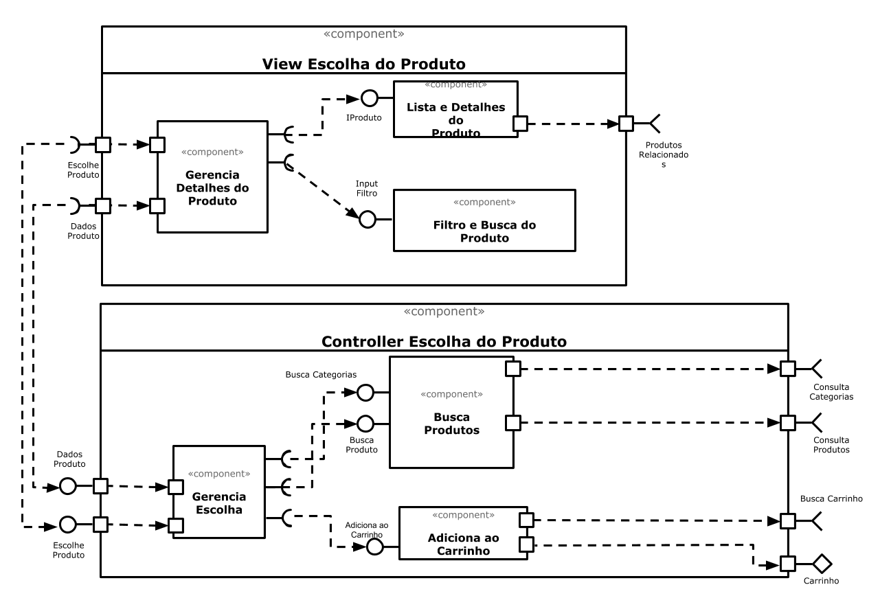

# Lab05 - Subcomponentes e Páginas Dinâmicas <!-- omit in toc -->

- [Tarefa 1](#tarefa-1)
- [Tarefa 2](#tarefa-2)
  - [HTML](#html)
  - [JavaScript](#javascript)

## Tarefa 1



## Tarefa 2

Link para o projeto no Codepen: [Tarefa 2 - Subcomponentes](https://codepen.io/gkshida/pen/BaKmZwv)

### HTML

```html
<div id="root"></div>
```

### JavaScript

```javascript
class Disciplina extends React.Component {
  render() {
    return (
      <dl>
        <li><strong>Nome:</strong> {this.props.sigla} - {this.props.nome}</li>
        <li><strong>Professor:</strong> {this.props.professor}</li>
        <hr/>
      </dl>   
    )
  }
}

const elemento = <div>
                   <h1>Disciplinas</h1>
                   <hr/>
                   <Disciplina sigla="INF0331" nome="Componentização e Reuso de Software: Conceitos e Práticas" professor="André Santanchè"/>
                   <Disciplina sigla="INF0325" nome="Modelagem e Projeto de Bancos de Dados" professor="Matheus Mota"/>
                   <Disciplina sigla="INF0318" nome="Análise Orientada a Objetos e Projeto Arquitetural" professor="Cecilia Mary Fischer Rubira"/>
                 </div>
ReactDOM.render(elemento, 
        document.getElementById("root"));
```